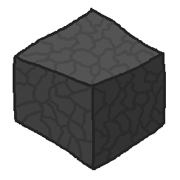

## basalt, a minecraft server

minecraft 1.8.9 server written in odin, nothing serious, just learning

## features
- [x] server appearing in multiplayer screen
- [ ] ping/pong
- [ ] favicon image
- [ ] gui maybe?
- [ ] actual login

## resources
- https://minecraft.wiki/w/Minecraft_Wiki:Projects/wiki.vg_merge (rip wiki.vg)
  - https://minecraft.wiki/w/Protocol?oldid=2772100
  - https://minecraft.wiki/w/Minecraft_Wiki:Projects/wiki.vg_merge/Data_types_(v47)
